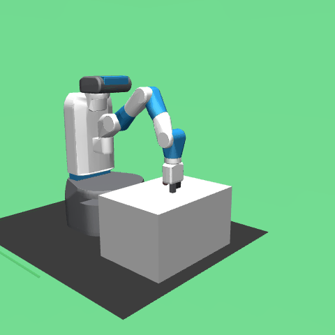
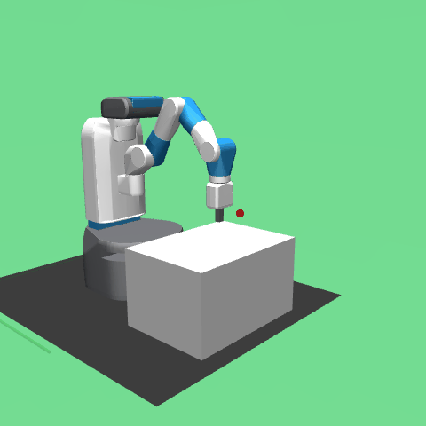
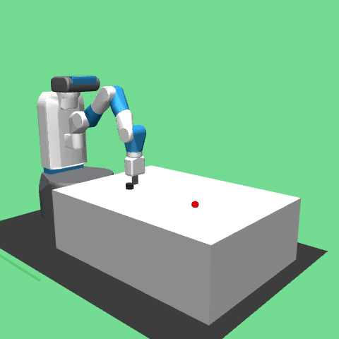

# Direct Control System (DCS)

A Unix-style CLI toolkit for Fetch robot control using socket-based IPC and deterministic mathematical algorithms.


## Quick Start

```bash
# Start a session
SESSION=$(bin/env start)

# Get positions
bin/object $SESSION
bin/target $SESSION

# Execute pick-and-place
bin/pick $SESSION 1.3 0.7 0.425
bin/place $SESSION 1.4 0.8 0.425

# Stop
bin/env stop $SESSION
```

## Supported Tasks

DCS works with any Fetch environment without code changes:

| Task | Command | Description |
|------|---------|-------------|
| Pick and Place | `bin/env start` | Grasp object, transport, release at target |
| Push | `bin/env start --env FetchPush-v4` | Push object to target position |
| Reach | `bin/env start --env FetchReach-v4` | Move gripper to target location |
| Slide | `bin/env start --env FetchSlide-v4` | Slide puck across table to target |

### Push Task


```bash
SESSION=$(bin/env start --env FetchPush-v4)
bin/push $SESSION 1.30 0.68 0.425
bin/env stop $SESSION
```

### Reach Task


```bash
SESSION=$(bin/env start --env FetchReach-v4)
bin/move $SESSION 1.27 0.89 0.62
bin/env stop $SESSION
```

### Slide Task


```bash
SESSION=$(bin/env start --env FetchSlide-v4)
bin/push $SESSION 1.42 0.83 0.414 --power=hard
bin/env stop $SESSION
```

## Architecture

```
CLI Tools          Socket IPC         Session
─────────          ──────────         ───────
bin/pick    ───►   Unix Domain   ───► DirectExecutor
bin/place          Sockets            MuJoCo Physics
bin/move           (~50μs)            OpenGL Render
bin/grip
```

- **Socket IPC**: ~50μs latency (vs 5-10ms file-based)
- **Thread Safety**: MuJoCo/OpenGL operations on main thread
- **Real-time Rendering**: 50fps visualization
- **Composable Tools**: Chain commands via shell

## Installation

```bash
python -m venv venv
source venv/bin/activate
pip install gymnasium gymnasium-robotics mujoco numpy opencv-python
```

Verify:
```bash
SESSION=$(bin/env start)
bin/status $SESSION
bin/env stop $SESSION
```

## CLI Reference

### Session Management
```bash
bin/env start [--env ENV] [--gif]   # Start session
bin/env list                         # List sessions
bin/env stop <id>                    # Stop session
```

### Robot Control
```bash
bin/move <id> <x> <y> <z>           # Move gripper
bin/grip <id> open|close            # Control gripper
bin/lift <id> <height>              # Lift vertically
bin/approach <id> <x> <y> <z>       # Move above position
```

### State Queries
```bash
bin/status <id>                     # Full state (JSON)
bin/object <id>                     # Object position
bin/target <id>                     # Target position
```

### Task Sequences
```bash
bin/pick <id> <x> <y> <z>           # Pick sequence
bin/place <id> <x> <y> <z>          # Place sequence
bin/push <id> <x> <y> <z>           # Push to target
```

## Python API

```python
from lib.fetch_api import FetchAPI

api = FetchAPI.connect(session_id)

# Query state
obj = api.get_object_position()
tgt = api.get_target_position()

# Execute
api.pick(obj)
api.place(tgt)

# Low-level
api.move_to([1.3, 0.7, 0.5])
api.grip(open=True)
api.lift(0.15)
```

## Performance

| Metric | DCS | Reinforcement Learning |
|--------|-----|------------------------|
| Setup | Instant | 60-90 min training |
| Success Rate | Deterministic | Variable |
| Precision | 2-4mm | ~50mm |
| Debugging | Full visibility | Black box |

## File Structure

```
dcs/
├── bin/                    # CLI tools
│   ├── env                 # Session management
│   ├── move, grip, lift    # Basic control
│   ├── pick, place, push   # Task sequences
│   └── object, target      # State queries
├── lib/                    # Core libraries
│   ├── fetch_api.py        # Python API
│   ├── direct_executor.py  # Command execution
│   └── fetch_session.py    # Session management
├── recordings/             # GIF outputs
└── CLAUDE.md               # Development guide
```

## License

MIT
